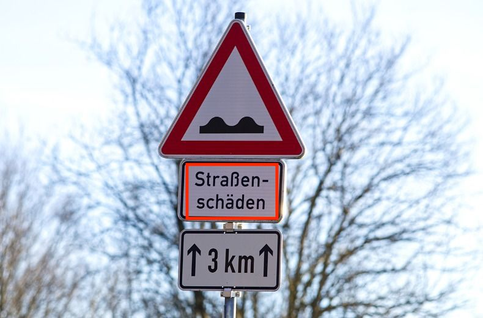
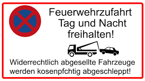

# grabtext-for-Mac
[](https://opensource.org/licenses/MIT)

The grabtext script pulls text out of screenshots using the screenshot feature built into MacOS. 

---
### Prerequisites
You will need to install the follow packages to use grabtext:
- [homebrew](https://brew.sh/)
- [make](https://formulae.brew.sh/formula/make) - *can be installed with homebrew*
- python3
- pip3

---
### Installation steps:
1. Clone the grabtext-for-Mac repo

2. From inside the cloned grabtext-for-Mac repo run ```make build```

---
### Using the grabtext script

1. Run the grabtext.py program from your terminal ```python3 grabtext.py ```
    - the built in screenshot function on your mac will appear, you can then select the region of the screen you wish to capture and copy to your clipboard
    - grabtext will copy the text from the screenshot to your clipboard
    
2. Paste your clipboard using "command⌘ + v"

---
### Cleanup
If you want to remove grabtext from your system you can run the cleanup script.
1. From the grabtext repo cloned in the Installation steps section above, use the ```make dry-run``` command to see which dependencies will be uninstalled if the cleanup script is run

2. From the grabtext repo cloned in the Installation steps section above, run ```make clean```
    - this cleanup script will remove tesseract and its dependencies
    - the packages installed by pip3 found in requirements.txt will also be removed


⚠️ By running the cleanup script you may uninstall dependencies that other software on your system requires to function. Be sure to check before you uninstall.

---
### Demo
Here is a demo of this script in action. I have included some screenshots of German road signs and their english translations that were captured with grabtext.

After running the script and taking a screenshot of the test images, grabtext was able to pull out the text from the following German street signs.



I pulled the following text out of the above image:
```StraBen-schaden```. When run through Google Translate I got the following english translation: "Road damage"



I pulled the following text out of the above image:
```"Feuerwehrzufahrt Tag und Nacht freihalten!"``` and ```"Widerrechtlich abgesellte Fahrzeuge werden kosenpfchtig abgeschleppt!"```. When run through Google Translate I got the following english translations: "Keep fire department access clear day and night!" and "Vehicles parked illegally will be towed away at a cost!" respectfully.

---
### Acknowledgements
The code in this repo utilizes three core components to function. 

1. [tesseract-ocr](https://github.com/tesseract-ocr/tesseract)

2. [pytesseract](https://github.com/madmaze/pytesseract)

3. [pyperclip](https://github.com/asweigart/pyperclip)